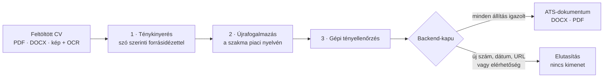
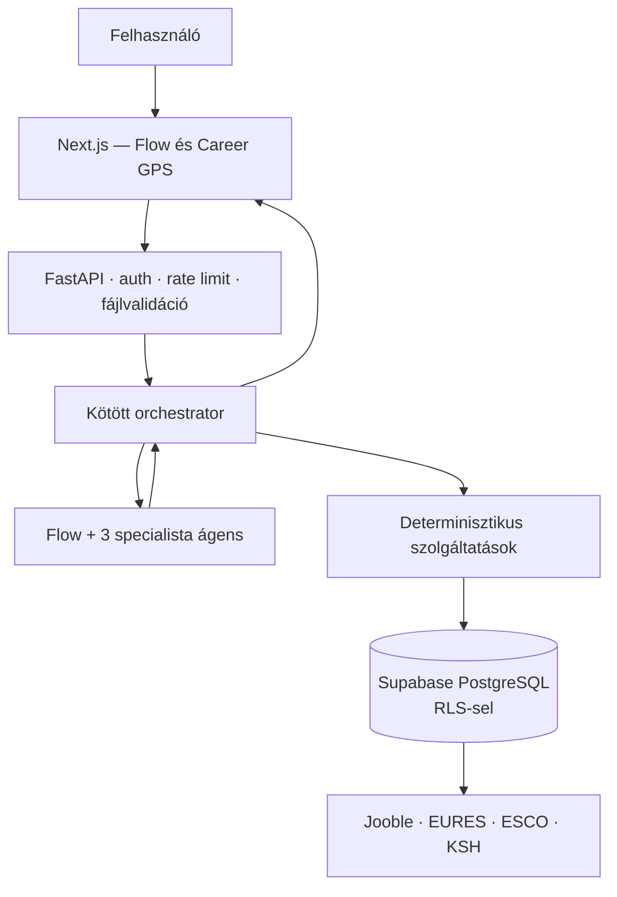

# Karrier-Ügynökség

**Adatvezérelt karrierplatform álláskeresőknek, pályaváltóknak és külföldi munkát keresőknek**

A rendszer a magyar álláspiac naponta frissülő saját adatbázisából dolgozik: ebből állapítja meg, mit vár el ma egy szakma, és ehhez méri a felhasználó önéletrajzát. A kimenet ATS-szabvány szerinti dokumentum, amely kizárólag a forrásban igazolt tartalmat használja fel.

**Élő alkalmazás:** https://ats-career-agent-z3od.vercel.app/

---

## Vezérelv: a döntést program hozza, nem a nyelvi modell

A rendszer legfontosabb tervezési döntése, hogy az érdemi számítás determinisztikus. A nyelvi modell értelmez és fogalmaz, de nem számol pontszámot, nem dönt állapotátmenetről, és nem állíthat a felhasználóról olyat, amit a feltöltött dokumentum nem igazol.

| Determinisztikus programkód | Nyelvi modell |
|---|---|
| illeszkedési pontszám és rangsor | beszélgetés és kérdezés |
| szakmabesorolás (ESCO, FEOR) | szakmai szöveg megfogalmazása |
| készségfelismerés és elvárásszámítás | értelmezés és összefoglalás |
| állapotgép és folyamatvezérlés | — |
| ATS-dokumentum előállítása | — |

Ugyanaz a bemenet mindig ugyanazt az eredményt adja: az eredmény reprodukálható, auditálható és tesztelhető.

---

## Adatvagyon

Az adatok napi automatikus gyűjtésből származnak (cron, 08:00 UTC).

| Adat | Darab |
|---|---:|
| Álláshirdetés | 16 503 |
| Ebből aktív | 16 118 |
| Szakma | 993 |
| ESCO-kapcsolattal rendelkező szakma | 989 |
| FEOR/KSH-kapcsolattal rendelkező szakma | 544 |
| Hirdetésből kinyert feladat vagy elvárás | 56 826 |
| ESCO-foglalkozás | 3 039 |
| ESCO-készség | 13 939 |
| ESCO foglalkozás–készség kapcsolat | 126 051 |
| CV-szókincs-változat | 11 911 |
| Napi szakma- és cégpillanatkép | 2 947 / 8 402 |

### Adatbizalmi szintek

A rendszer nem állít semmit, amire nincs elég adata. Minden szakma három külön kérdésre kap bizalmi szintet, abszolút darabszám alapján:

| Szint | Kereslet | Bér | Elvárás |
|---|---|---|---|
| `eros` | ≥ 20 aktív állás | ≥ 10 béradatos hirdetés | ≥ 30 tétel |
| `gyenge` | ≥ 5 | ≥ 4 | ≥ 10 |
| `nincs` | ez alatt | ez alatt | ez alatt |

Gyenge lefedettségnél a hirdetésminták nem jutnak el a CV-íróhoz; ilyenkor csak az ESCO szakmai törzsanyag használható.

---

## A CV-lánc

A dokumentumkészítés három, egymástól elkülönített lépésen halad át. A lánc célja, hogy ne keletkezhessen olyan állítás, amely nem vezethető vissza az eredeti önéletrajzra.



1. **Ténykinyerés** — tény csak szó szerint visszakereshető forrásidézettel adható át.
2. **Újrafogalmazás** — a CV-író kizárólag ezeket a tényeket fogalmazhatja újra, a célszakma mért piaci nyelvén.
3. **Tényellenőrzés** — minden nem igazolt állítás eltávolításra kerül.
4. **Backend-kapu** — új szám, dátum, URL vagy elérhetőség megjelenése esetén a folyamat nem ad ki eredményt.

A célmunkakör ESCO-leírása és kapcsolt készségei **szakmai szókincset** adnak, de nem bizonyítják, hogy a felhasználó rendelkezik velük — ezek kérdésként, nem állításként kerülnek vissza a felhasználóhoz.

---

## Determinisztikus elemzőréteg

| Modul | Feladat |
|---|---|
| `hirdetes_bontas` | A hirdetés a munkáltató saját tagolása mentén bomlik feladatra, elvárásra és juttatásra; a bérre vagy a cég önjellemzésére utaló tételeket tartalom alapján sorolja át |
| `szakma_elvarasok` | Elvárás az, ami az adott szakmában lényegesen gyakoribb, mint a teljes piacon, és több megfogalmazásban visszatér — a sablonszöveg és a duplikált hirdetés kiesik |
| `keszseg_felismero` | Magyar nyelvű készségfelismerés szótő-illesztéssel, szakmánként eltérő jelentéssel |
| `szakma_besorolo` | Hirdetés → szakma besorolás, ESCO- és FEOR-megfeleltetéssel |
| `cv_szakma_javaslat` | Célmunkakör felismerése a CV soraiból, a végzettségek kiszűrésével, mért önkonzisztenciával |
| `pozicionevek` | A hirdetéscímekből kinyert bevett megnevezések; jelzi, ha a CV olyan néven írja a munkakört, amilyenre nem keresnek |
| `career_state_machine` | Kötött állapotátmenetek; érzékeny művelet csak kifejezett jóváhagyással indul |
| `ats_renderer` | Egy hasábos, táblázat és díszítés nélküli ATS-kimenet DOCX- és PDF-formátumban |

### Önmagát bővítő szinonimaszótár

A `szotar_tanulo` szakmánként tanulja meg, mely kifejezések tartoznak következetesen ugyanahhoz a készséghez, támogatottsági és pontossági küszöbbel. A mérés **elkülönített, tanulásból kihagyott hirdetéshalmazon** történik, és kimutatja a szótáralapú felismerés elvi felső korlátját is.

---

## További szolgáltatások

- **Piaci körkép** szakmánként: kereslet, munkáltatói kör, hirdetett bérsáv és a leggyakoribb elvárások
- **Átjárhatósági számítás** ESCO-készségátfedésből: mely szakmákat fedi a meglévő tudás, és mi hiányzik a célhoz
- **Bérkép két forrásból:** hirdetett medián és hivatalos KSH-adat, kérdésenként külön adatbizalmi szinttel. A hirdetések 15,9%-a tartalmaz forintban megadott bért, FEOR/KSH-kapcsolat 544 szakmánál áll rendelkezésre — ezért a bérállítás szakmai mintára épül, egyedi hirdetésre nem.
- **EURES-integráció** harminc európai országra
- **Portfóliógenerátor:** önéletrajzból szerkeszthető bemutatkozó oldal, engedélyezőlistás szerkesztőágenssel — a modell szabad HTML-t nem állíthat elő

**Megvalósítva, de adathiány miatt még nem élesített:** a képzésajánló modul kész, a kurált képzési adatbázis jelenleg 12 tételt tartalmaz, ami ajánláshoz nem elegendő.

---

## Architektúra



Az orchestrator ellenőrzi az ágens javaslatát, a bemenetet, a jogosultságot, a költségkeretet és a jóváhagyást. Az ágens önállóan nem kap hozzáférést a rendszerhez.

### Ágensek és korlátaik

| Ágens | Feladata | Nem teheti meg |
|---|---|---|
| **Flow Manager** | Megérti a kérést, kérdez, rendszerrészt indít, összefoglal | Nem ír adatbázist, nem publikál, nem küld jelentkezést |
| **Karriertanácsadó** | Profil, piac és tudásbázis alapján karrierutat fogalmaz | Nem diagnosztizál, nem talál ki piaci adatot |
| **Pályázati anyagkészítő** | Igazolt tényekből állásra szabott CV- és levéltervezet | Nem írhat be nem igazolt készséget vagy eredményt |
| **Portfólió-dizájner** | Tartalmi és vizuális koncepció | Nem generál futtatható HTML-t, nem publikál |

Az ATS, az állásrangsor, a piaci elemzés, a pályaváltás, a képzés és az EURES **nem ágens**, hanem ellenőrizhető programrendszer.

---

## Biztonsági modell

| Veszély | Védelem |
|---|---|
| Prompt injection | Bemeneti guardrail; a felhasználói és CV-szöveg adatként kezelve, nem utasításként; kötött ágenskimenet |
| Kitalált CV-adat | Forrásidézet-kényszer; bizonyíték nélküli állítás blokkolva |
| Másik felhasználó adata | Auth, `user_id`, soralapú jogosultságkezelés (RLS), privát Storage |
| Jogosulatlan ágensművelet | Eszköz-engedélyezőlista és központi orchestrator |
| Küldés, törlés, publikálás | Konkrét előnézet és egyszeri emberi jóváhagyás |
| Portfólió-XSS | Fix escaping, URL-engedélyezőlista, CSP, izolált előnézet |
| Költségtámadás | Rate limit, napi keret, timeout, cache, tartalékút |
| Elavult piaci adat | Forrás, forrásdátum, frissességi és adatminőségi kapu |

---

## Technológia

**Backend** — Python · FastAPI · Pydantic · PostgreSQL (Supabase, RLS) · verziózott sémamigrációk

**Frontend** — Next.js · React · Tailwind CSS · Vercel

**Adat és dokumentum** — pandas · ESCO- és FEOR-osztályozás · OCR · python-docx · PDF-generálás

**Modellréteg** — szolgáltatófüggetlen gateway két AI-szolgáltatóval · hívásonkénti költségnaplózás · strukturált JSON-kimenet

**Minőség** — pytest · 248 automatizált backend-teszt · golden flow tesztek · GitHub Actions

---

## Repóstruktúra

```
backend/      FastAPI, állapotgép, CV-lánc, determinisztikus elemzők, tesztek
agents/       Flow és a három specialista ágens
utils/        adatbázis, dokumentumsablonok, EURES, profil
scripts/      adatgyűjtés, ESCO-betöltés, szótártanulás, mérőszkriptek
db/           séma, ESCO- és FEOR-törzsadat, tisztító lekérdezések
supabase/     migrációk
frontend/     Next.js alkalmazás
docs/         rendszerterv, állapotgép, adatbázis-állapot
```

---

## Helyi futtatás

```bash
# Backend
pip install -r backend/requirements.txt
uvicorn backend.main:app --reload

# Frontend
cd frontend && npm install && npm run dev
```

**Környezeti változók**

```env
DATABASE_URL=...
SUPABASE_URL=...
SUPABASE_KEY=...
OPENAI_API_KEY=...
JOOBLE_API_KEY=...
```

**Tesztek**

```bash
pytest backend/
```

---

## Fejlesztési megközelítés

A projekt AI-native munkafolyamatban készült. A rendszertervezési döntések, az adatforrások kiválasztása, a validációs szabályok és a biztonsági modell **emberi döntések** alapján születtek; az implementáció iteratív fejlesztéssel, teszteléssel és ellenőrzéssel valósult meg.

A tervezés a kódolás előtt zárult le: a `docs/` mappa tartalmazza a rendszertervet, a felhasználói állapotgépet és a részletes, főrészenkénti specifikációt.
