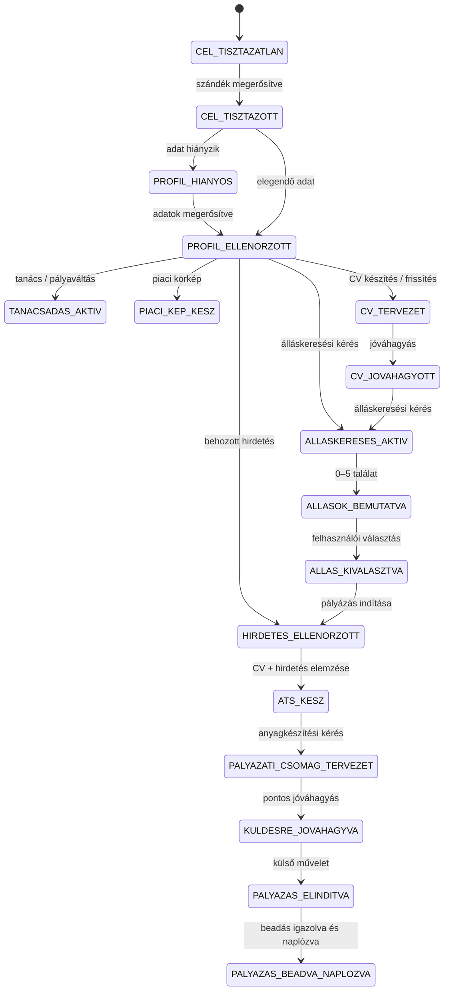
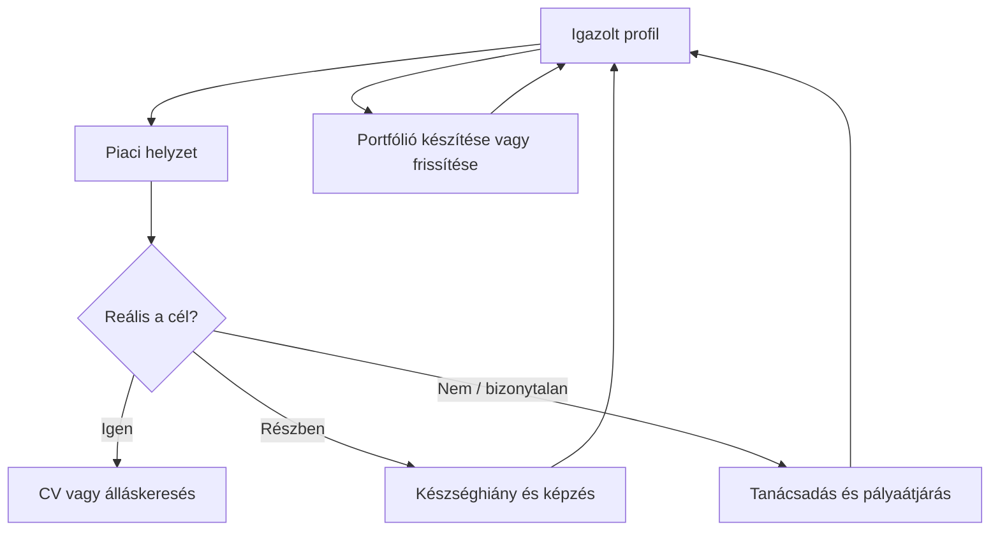

# Karrier-Ügynökség — kanonikus felhasználói állapotgép

Állapot: **tervezési alap — 2026-07-24**

Ez a dokumentum a rendszer felhasználói működésének elsődleges forrása.
Ha egy korábbi terv automatikus ATS-elemzést, kötelező öt állást vagy
szándéktisztázás nélküli folyamatindítást ír le, ezen dokumentum szabályai
az irányadók.

## 1. A termék feladata

A Karrier-Ügynökség személyre szabott digitális karriertanácsadó és
pályázás-végrehajtó rendszer. A felhasználót a bizonytalanságtól vagy meglévő
karriercéltól elvezeti a bizonyítékokra épülő, beadásra kész pályázatig.

A rendszer:

- megérti, hogy a felhasználó most mit szeretne;
- felépíti és frissíti az igazolt karrierprofilt;
- saját, naponta frissülő adatbázisból piaci helyzetet mutat;
- személyre szabott tanácsot, pályairányt és képzést ajánl;
- kérésre megfelelő állásokat rangsorol;
- kiválasztott álláshoz pályázati anyagot készít;
- jóváhagyással támogatja vagy végrehajtja a jelentkezést;
- megőrzi a folyamat állapotát és a felhasználó által megadott eredményeket.

A rendszer nem általános chatbot, nem egyszerű CV-generátor és nem dönt a
felhasználó helyett.

## 2. Kötelező vezérlési elvek

1. Flow először a **jelenlegi célt** tisztázza. CV-feltöltésből önmagában nem
   következik álláskeresés.
2. Az utak nem kötelező sorrendű oldalak. A felhasználó bármely releváns
   állapotból indulhat, visszaléphet és másik útra válthat.
3. Flow csak strukturált következő lépést javasol. Az orchestrator ellenőrzi és
   indítja a modult.
4. Pontszámot, rangsort, jogosultságot és állapotátmenetet program számít.
5. LLM értelmezhet és fogalmazhat, de nem találhat ki tapasztalatot, készséget,
   piaci adatot vagy pályázási eredményt.
6. ATS csak **egy kiválasztott vagy behozott konkrét álláshirdetéshez** fut.
7. Álláskeresés csak kifejezett felhasználói kérésre indul. A találatok száma
   legfeljebb öt, nem kötelezően öt.
8. Küldéshez, publikáláshoz, adatmegosztáshoz és külső művelethez pontos
   előnézet és egyszer használható jóváhagyás szükséges.
9. A pályázat eredményét nem találja ki a rendszer. A beadást technikai
   visszaigazolás vagy felhasználói jelzés rögzíti; interjú, elutasítás és
   ajánlat csak felhasználói frissítésből származhat.

## 3. Fő belépési szándékok

| Szándék | Jelentése | Első modul | Amit nem indít el automatikusan |
|---|---|---|---|
| `cv_ellenorzes` | Meglévő CV minőségének megismerése | Karrierprofil és CV | Álláskeresés, célzott ATS |
| `cv_frissites` | CV korszerűsítése a célmunkakör piacához | Profil + piaci készségkép | Álláskeresés |
| `cv_keszites` | Nincs használható CV | Profilinterjú és CV-vázlat | Álláskeresés jóváhagyás nélkül |
| `allas_kereses` | Megfelelő állásokat szeretne találni | Profilkészültség, majd állásillesztés | ATS és dokumentumgenerálás |
| `konkret_palyazas` | Már van egy kiválasztott hirdetés | Hirdetésbeolvasás + profil | További állások keresése |
| `tanacsadas` | Döntési vagy karrierhelyzeti segítséget kér | Career Advisor | Álláskeresés |
| `palyavaltas` | Másik szakmába menne vagy keresi az irányt | Tanácsadás + átjárás + piac | Automatikus célkijelölés |
| `piaci_korkep` | Saját szakmája vagy célja piaci helyzetét nézné meg | Piaci aggregátor | CV-módosítás |
| `kepzes_kereses` | Igazolt készséghiányhoz keres képzést | Képzésrangsoroló | Pályaváltás feltételezése |
| `portfolio` | Projektjeit szeretné bemutatni | Portfólió Stúdió | Publikálás jóváhagyás nélkül |
| `bizonytalan` | Nem egyértelmű, mire van szüksége | Flow tisztázó kérdése | Bármely üzleti modul |

A „konkrét pályázás” álláshirdetése három forrásból érkezhet:

- az alkalmazás találatai közül választja ki;
- hirdetéslinket vagy hirdetésszöveget ad meg;
- dokumentumot vagy képernyőképet tölt fel, majd jóváhagyja a kivonatot.

## 4. Fő állapotok

| Állapot | Jelentése | Kilépési feltétel |
|---|---|---|
| `CEL_TISZTAZATLAN` | Flow még nem tudja, mit kér a felhasználó | Egy szándék megerősítve |
| `CEL_TISZTAZOTT` | A jelenlegi feladat ismert | A szükséges profilmezők ellenőrizve |
| `PROFIL_HIANYOS` | Nincs elég igazolt adat a feladathoz | A felhasználó megerősíti a szükséges adatokat |
| `PROFIL_ELLENORZOTT` | A feladathoz szükséges profil rendelkezésre áll | A választott szolgáltatás elindul |
| `TANACSADAS_AKTIV` | Tanácsadás, teszt vagy pályairány-elemzés folyik | A felhasználó dönt a következő lépésről |
| `PIACI_KEP_KESZ` | Dátumozott, forrásolt piaci összevetés elkészült | A felhasználó folytatást választ |
| `CV_TERVEZET` | CV készült vagy módosult, de nincs jóváhagyva | Jóváhagyás vagy javítás |
| `CV_JOVAHAGYOTT` | Aktuális, igazolt CV-verzió használható | Következő cél kiválasztva |
| `ALLASKERESES_AKTIV` | Személyre szabott keresés/rangsorolás fut | Találati eredmény |
| `ALLASOK_BEMUTATVA` | Legfeljebb öt megfelelő találat látható | Választás vagy keresésmódosítás |
| `ALLAS_KIVALASZTVA` | Egy vagy több állás érdekli a felhasználót | Egy álláshoz elindítja a pályázást |
| `HIRDETES_ELLENORZOTT` | A konkrét hirdetés és jelentkezési mód hitelesítve | ATS indítható |
| `ATS_KESZ` | CV és egy konkrét hirdetés összevetése elkészült | Anyagkészítési kérés |
| `PALYAZATI_CSOMAG_TERVEZET` | CV, levél, portfóliólink és beadási lista elkészült | Jóváhagyás vagy javítás |
| `KULDESRE_JOVAHAGYVA` | Cél és anyagok pontosan jóváhagyva | Külső művelet vagy megszakítás |
| `PALYAZAS_ELINDITVA` | Jelentkezési oldal megnyílt vagy e-mail előkészítve | Beadás igazolva vagy mentve |
| `PALYAZAS_BEADVA_NAPLOZVA` | A beadás technikai visszaigazolással vagy felhasználói jelzéssel igazolt, és az auditnapló-bejegyzés elkészült | A pályázási folyamat lezárult |

A kanonikus pályázási folyamat határa a beadás és annak naplózása. Az interjú,
elutasítás vagy ajánlat későbbi, kizárólag felhasználói eredetű fiókeseményként
rögzíthető, de nem hosszabbítja meg és nem nyitja újra a beadási folyamatot.

A tanácsadás, piaci körkép, képzés és portfólió több állapotból megnyitható,
majd a felhasználó visszatérhet az előző aktív céljához.

## 5. Állapotátmenetek

Bármely állapotból lehetséges:

- `cel_modositva`: visszatérés `CEL_TISZTAZOTT` állapotba;
- `profil_valtozott`: visszatérés profil-ellenőrzéshez;
- `feladat_megszakitva`: lezárás adatvesztés nélkül;
- `elozo_feladat_folytatasa`: mentett munkapéldány folytatása.

## 6. A CV három külön szolgáltatása

### CV-ellenőrzés

A dokumentum minőségének, szerkezetének és általános ATS-olvashatóságának
vizsgálata. Nem keres állást és nem futtat állásspecifikus ATS-egyezést.

### Piaci CV-frissítés

A megerősített célmunkakör friss, adatbázisban mért készségei és
megfogalmazásai alapján korszerűsíti a CV-t. Hiányzó készség csak kérdésként
vagy fejlesztési hiányként jelenhet meg; a CV-be csak igazolt tény kerülhet.

### Állásspecifikus CV

Egy ellenőrzött, konkrét álláshirdetéshez igazítja a CV hangsúlyait.
Ehhez előbb állásspecifikus ATS-elemzés készül. Új szakmai tény nem keletkezhet.

## 7. Személyre szabott álláskeresés

- Az álláskeresést a felhasználó kéri.
- A rangsor bemenete az igazolt profil, cél, korlátok és friss hirdetés.
- Csak a minimumkapukat teljesítő találatok jelennek meg.
- Legfeljebb öt találat látható; ha csak kettő megfelelő, kettőt mutat.
- Minden találatnál látható az illeszkedés oka, hiány, frissesség és forrás.
- A kiválasztás nem indít automatikus CV-írást vagy jelentkezést.
- Több állás kiválasztható, de mindegyik külön munkapéldány és jóváhagyás.

## 8. Pályázás végrehajtása

| Csatorna | Első változat | Későbbi automatizálás |
|---|---|---|
| E-mail | címzett, tárgy, törzs és mellékletek előnézete; jóváhagyás után küldés | visszaigazolás és válasz összekapcsolása |
| Vállalati karrieroldal | link, szükséges mezők és dokumentumok; oldal megnyitása | engedélyezett böngészőautomatizálás csak a konkrét céloldal, mezőértékek, dokumentumverziók és beadási művelet pontos emberi jóváhagyásával |
| Állásportál | eredeti hirdetés és beadási ellenőrzőlista | feltételek és technikai lehetőség szerinti integráció |
| Ismeretlen/hibás csatorna | küldés blokkolva, pontosítás | nincs automatikus kerülőút |

Külső elküldés előtt a jóváhagyás tartalmazza:

- a konkrét állást és céget;
- a célcímet vagy céloldalt;
- a dokumentumok pontos verzióját;
- az e-mail tárgyát és törzsét, ha releváns;
- az átadott személyes adatok listáját;
- a jóváhagyás lejáratát.

Az agent csak tervezetet készít. A küldőeszközt az orchestrator hívja meg az
érvényes jóváhagyás ellenőrzése után.

## 9. Tanácsadás, piac és képzés visszatérő köre

A „reális” eredmény programozott kapukból, bizonyított készségekből,
felhasználói korlátokból és friss piaci adatokból készül. Flow elmagyarázza,
a felhasználó dönt.

## 10. Agentek és determinisztikus rendszerek

| Lépés | Felelős | Működés |
|---|---|---|
| Szándék értelmezése | Flow Manager | strukturált LLM-kimenet + validáció |
| Profiladat kinyerése | Kinyerő pipeline | kötött séma + megerősítés |
| Profil módosítása | Profil-szolgáltatás | determinisztikus eseménykezelés |
| Piaci mérőszámok | Piaci aggregátor | SQL és verziózott képletek |
| Karrierértelmezés | Career Advisor | forrásolt LLM-szöveg |
| Pályaátjárás | Átjárás-rangsoroló | determinisztikus összehasonlítás |
| Képzésajánlás | Képzésrangsoroló | ellenőrzött adatok + rangsor |
| Állásillesztés | Állásillesztő | pontozás és hard gate-ek |
| ATS | ATS-elemző | CV + egy konkrét hirdetés |
| CV/levél tervezet | Application Materials Agent | csak igazolt tényekből |
| Portfólióterv | Portfolio Designer | tartalom- és designspecifikáció |
| HTML előállítás | Biztonságos renderer | komponenskatalógus, escaping, CSP |
| Küldés/megnyitás | Pályázási connector | jóváhagyás után, auditáltan |
| GPS frissítés | Career GPS projektor | csak érvényes domain-eseményből |

Egy agent sem hívhat közvetlenül küldőeszközt, nem írhat adatbázist és nem
változtathat Career GPS állapotot.

## 11. Career GPS és felhasználói fiók

A bejelentkezés szükséges személyes dokumentumokhoz, pályázásokhoz és
folyamatfolytatáshoz. Nyilvános piaci körkép vagy bemutató használható fiók
nélkül, de személyes adat nem menthető.

A fiókban később megjelenik:

- igazolt karrierprofil és forrásai;
- CV-, levél- és portfólióverziók;
- mentett és kiválasztott állások;
- pályázati munkapéldányok és jóváhagyások;
- a felhasználó által frissített pályázati állapotok;
- Career GPS, blokkolók és következő választható lépések.

A GPS nem talál ki „sikerességet”. Csak igazolt eseményt mutat, például:
`profil_megerositve`, `cv_jovahagyva`, `allas_kivalasztva`,
`palyazati_csomag_jovahagyva`, `palyazas_beadva`, `interju_jelolve`.

## 12. Elfogadási feltételek

1. Bizonytalan szándék nem indíthat üzleti műveletet.
2. CV-feltöltés önmagában nem indít álláskeresést.
3. Álláskeresés önmagában nem indít ATS-t vagy dokumentumgenerálást.
4. ATS nem futhat ellenőrzött konkrét hirdetés nélkül.
5. Pályázati anyag nem készülhet igazolt profil nélkül.
6. Külső küldés nem történhet pontos, érvényes jóváhagyás nélkül.
7. Több kiválasztott állás külön pályázási munkapéldányt kap.
8. A felhasználó bármely munkát megszakíthat és később folytathat.
9. Minden állapotváltozás auditálható, felesleges nyers személyes adat nélkül.
10. A tanácsadás, piaci körkép, képzés és portfólió visszatérő, körkörös útvonal.
11. Az agentek hibás vagy sémán kívüli kimenete nem változtat állapotot.

## 13. Első megvalósítási szelet

1. Flow tisztázza az `allas_kereses` szándékot.
2. A felhasználó belép, feltölti vagy kiválasztja a jóváhagyott CV-jét.
3. Megerősíti a célmunkakört és a keresési korlátokat.
4. A rendszer legfeljebb öt megfelelő állást rangsorol.
5. A felhasználó egy állást kiválaszt.
6. A rendszer ellenőrzi a hirdetést és állásspecifikus ATS-t készít.
7. Kérésre elkészül a célzott CV és motivációs levél.
8. A felhasználó jóváhagyja a pontos pályázati csomagot.
9. E-mailes csatornán jóváhagyás után megtörténhet a küldés; más csatornán a
   rendszer megnyitja a jelentkezési oldalt és végigvezet a beadáson.
10. A beadás igazolása és minden állapotátmenet naplózásra kerül.

Ez a szelet bizonyítja az agent-orchestrációt, determinisztikus döntéseket,
RAG/forráskezelést, FastAPI- és Supabase-integrációt, emberi jóváhagyást,
külső műveletet, auditot, biztonságot és tesztelhetőséget. A tanácsadás,
piaci körkép, képzés és portfólió ugyanennek az állapotgépnek további,
megőrzendő útvonalai.
