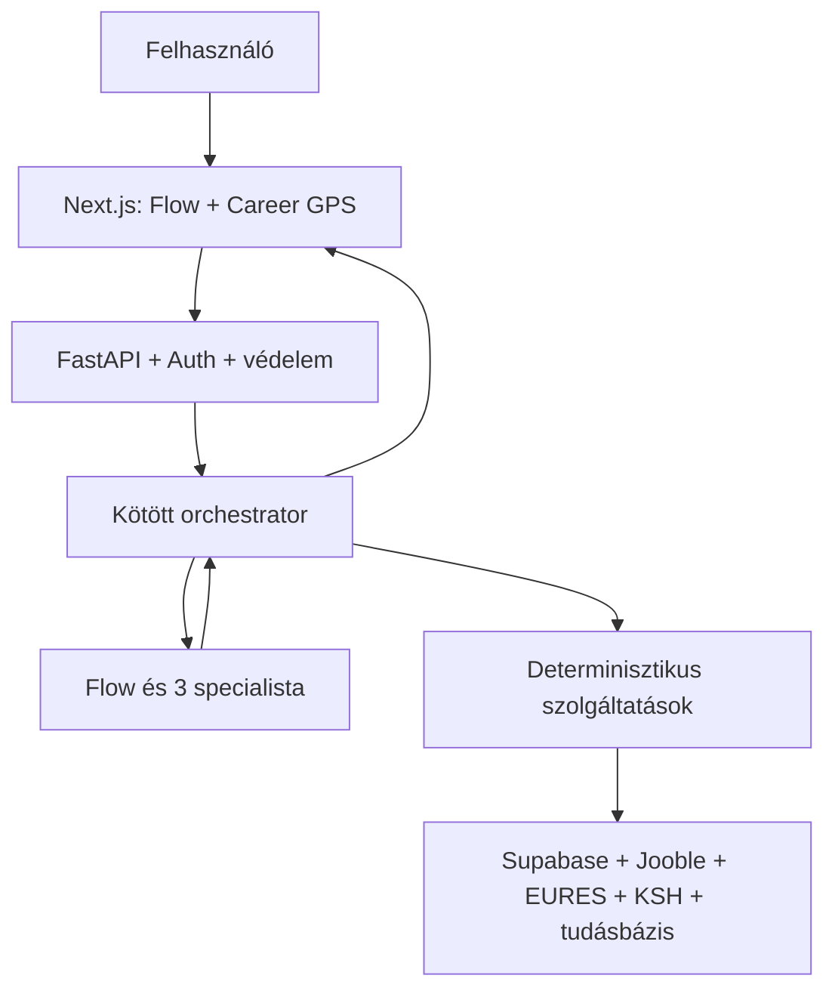

# Karrier-Ügynökség — rendszerterv

Állapot: **1. fázis — jóváhagyva 2026-07-23**
A részletes specifikáció: [reszletes-terv/README.md](reszletes-terv/README.md).
Programkód még nem készült.

## 1. Termékcél

A Karrier-Ügynökség egy interaktív, személyre szabott karrierrendszer.
Flow megismeri a felhasználó célját és igazolt szakmai hátterét, majd egyetlen
folyamatban segít:

- karrierirányt vagy pályaváltási utat választani;
- a szakma valós piaci helyzetét megérteni;
- a profilhoz legjobban illeszkedő állásokat megtalálni;
- CV-t és motivációs levelet készíteni vagy javítani;
- képzést és külföldi lehetőséget választani;
- magas színvonalú, dinamikus HTML-portfóliót készíteni.

## 2. Kötelező működési elvek

1. **Flow az egyetlen látható beszélgetőtárs.**
2. **A felhasználó dönt:** cél, shortlist, dokumentum, képzés és publikálás.
3. **A számításokat program végzi:** pontszám, rangsor, piac, teszt és átjárás.
4. **Az LLM értelmez és fogalmaz**, de nem találhat ki szakmai tényt vagy adatot.
5. **Minden személyre szabás igazolt profilból készül.**
6. **Minden piaci állításnak forrása és dátuma van.**
7. **Minden érzékeny írási vagy külső művelet jóváhagyást kér.**
8. **A felhasználói, CV-, web- és RAG-szöveg adat, nem végrehajtható utasítás.**

## 3. A rendszer nyolc fő része

| # | Főrész | Feladata | Meghatározó működés |
|---:|---|---|---|
| 1 | **Platform, adat és biztonság** | Auth, Supabase, adatvédelem, jogosultság, guardrail, kvóta és naplózás. | Determinisztikus infrastruktúra |
| 2 | **Flow és Career GPS** | Beszélgetés, célfelismerés, útvonalválasztás, állapot és következő lépés. | Flow Manager + kötött orchestrator |
| 3 | **Karrierprofil és CV** | CV/fotó beolvasása, tények ellenőrzése, CV készítése CV nélkül, ATS. | Determinisztikus pipeline + kötött kinyerés |
| 4 | **Állások és pályázati anyagok** | Személyes rangsor, céginformáció, shortlist, CV/levél, PDF/DOCX. | Determinisztikus rangsor + Pályázati agent |
| 5 | **Piaci körkép és karriertanácsadás** | Kereslet, trend, készségek, bér, teszt és forrásolt tanács. | Determinisztikus elemzés + Tanácsadó agent |
| 6 | **Pályaváltás és képzések** | Átjárási utak, készséghiány, reális képzési terv. | Determinisztikus összehasonlítás |
| 7 | **Külföldi lehetőségek** | EURES-állások ország, nyelv és profil szerinti illesztése. | Determinisztikus szűrés és rangsor |
| 8 | **Portfólió Stúdió** | Tetszőleges projektekből vizuális terv, biztonságos dinamikus HTML és publikálás. | Dizájner agent + biztonságos renderer |

Ez a nyolc főrész jelenik meg a további tervezésben. A fájlfeltöltés,
sanitizálás, rate limit vagy PDF-renderelés ezek belső technikai eleme, nem
külön termékmodul.

## 4. Agentarchitektúra

| Agent | Feladata | Nem teheti meg |
|---|---|---|
| **Flow Manager** | Megérti a kérést, kérdez, megfelelő rendszerrészt indít és összefoglal. | Nem ír közvetlenül adatbázist, nem publikál és nem küld jelentkezést. |
| **Karriertanácsadó** | A profil, teszt, piac és tudásbázis alapján értelmez és karrierutat fogalmaz. | Nem diagnosztizál és nem talál ki piaci adatot. |
| **Pályázati anyagkészítő** | Igazolt tényekből állásra szabott CV- és levéltervezetet készít. | Nem írhat be nem igazolt készséget vagy eredményt. |
| **Portfólió-dizájner** | A projektekhez tartalmi és vizuális koncepciót készít. | Nem generál futtatható HTML/JavaScriptet és nem publikál. |

Az ATS, állásrangsor, piac, teszt, pályaváltás, képzés, EURES és
HTML-renderelés nem agent: ellenőrizhető programrendszer.

## 5. Magas szintű rendszerkapcsolat

Az orchestrator ellenőrzi az agent javaslatát, a bemenetet, a jogosultságot,
a költségkeretet és a jóváhagyást. Az agent önállóan nem kap korlátlan
hozzáférést a rendszerhez.

## 6. Fő felhasználói utak

### Van CV-je

Flow tisztázza a célt → CV beolvasás → felhasználó ellenőrzi a profilt →
piaci kép → személyes állásrangsor → shortlist → ATS → pályázati anyag.

### Nincs CV-je

Flow minimális kérdésekkel felépíti az igazolt profilt → alap-CV →
piaci kép → személyes állásrangsor → ATS → pályázati anyag.

### Pályát váltana vagy kimerült

Flow megérti a helyzetet → opcionális teszt → tanácsadói értelmezés →
reális átjárási utak → piaci összevetés → képzési terv → új célállások.

### Külföldön keresne munkát

Célország, nyelv és feltételek → igazolt profil → EURES-találatok →
személyes rangsor → shortlist → ATS → megfelelő nyelvű pályázati anyag.

A Portfólió Stúdió bármelyik útból elérhető, ha a projektek bemutatása
előnyt ad, vagy a felhasználó kéri.

## 7. Felületi koncepció

- Nincs hat statikus fül és nincs hosszú kezdőűrlap.
- A főképernyő bal oldalán Flow beszélgetése és az aktuális munkafeladat látszik.
- Jobb oldalon a Career GPS mutatja, hogyan épül a profil és a karrierút.
- Flow a megfelelő eszközt a beszélgetésbe húzza be.
- Egyszerre egy fő döntés jelenik meg.
- A sötétkék–arany márka és a jelenlegi logó megmarad.
- Mobilon a Career GPS felhúzható panelként működik.

## 8. Biztonsági alapmodell

| Veszély | Rendszerszintű védelem |
|---|---|
| Prompt injection / értelmetlen vagy támadó szöveg | Bemeneti guardrail; a szöveg adatként kezelve; kötött agentkimenet |
| Kitalált CV-adat | Igazolt bizonyítékjegyzék; bizonyíték nélküli állítás blokkolva |
| Másik felhasználó adata | Auth, `user_id`, RLS és privát Storage |
| Jogosulatlan agentművelet | Eszköz-allowlist és központi orchestrator |
| Küldés, törlés vagy publikálás | Konkrét előnézet és egyszeri emberi jóváhagyás |
| Portfólió-XSS / rosszindulatú link | Fix escaping, URL-allowlist, CSP és izolált előnézet |
| AI-kvóta vagy költségtámadás | Rate limit, napi keret, timeout, cache és tartalékút |
| Hamis/elavult piaci adat | Forrás, forrásdátum, frissességi és adatminőségi kapu |

A biztonság nem külön utólagos modul. A részletes specifikációban mind a
nyolc főrész saját jogosultságot, támadási esetet és elfogadási tesztet kap.

## 9. Fejlesztési szakaszok

### 1. Rendszerterv

Ez a dokumentum. A nyolc főrész, agentmodell, kapcsolatok, felhasználói utak,
felületi irány és biztonsági alap jóváhagyása.

### 2. Részletes kidolgozás

A nyolc főrészt egyenként, azonos sablonnal tervezzük:

- cél és hatókör;
- bemenet és adatforrás;
- belső részek;
- determinisztikus logika vagy agent;
- adatmodell és API;
- eszközök, jogosultságok és jóváhagyások;
- kimenet és Career GPS-módosítás;
- hibakezelés és biztonsági tesztek;
- frontend működés;
- mérhető elfogadási feltételek.

A programozás csak mind a nyolc rész kapcsolódásának lezárása után indul.

### 3. Megvalósítás

1. Platform, adat és biztonság.
2. Flow, Career GPS és karrierprofil.
3. Állásrangsor, piac, ATS és pályázati anyag.
4. Tanácsadás, pályaváltás, képzés és külföld.
5. Portfólió Stúdió.
6. Teljes integráció, automatikus és támadó tesztek.

Egy fejlesztési rész csak működő backenddel, jogosultsággal, teszttel,
frontenddel és elfogadási ellenőrzéssel tekinthető késznek.

## 10. Jóváhagyott döntések

1. A nyolc főrész lefedi az alkalmazás szükséges képességeit.
2. Flow az egyetlen látható kezelő, mögötte három specialista dolgozik.
3. A négy fő felhasználói út megfelelő; a visszatérő használat állapotfolytatás.
4. A felület alapja a Flow és a jobb oldali Career GPS.
5. A biztonsági alapelvek megfelelőek; részletesen főrészenként érvényesítendők.
