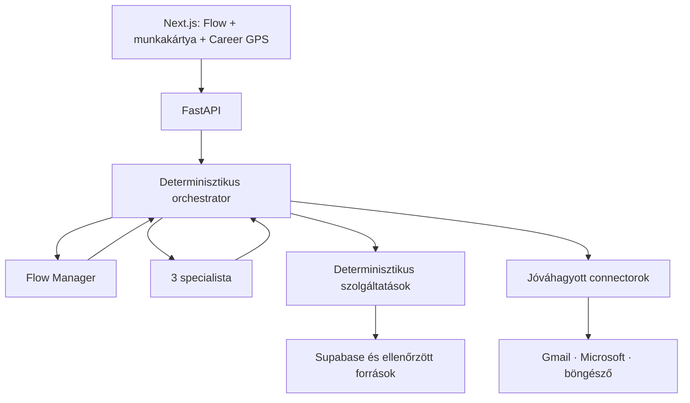

# Karrier-Ügynökség — modell- és agentarchitektúra

Állapot: **részletes terv — 2026-07-24**

Kapcsolódó dokumentumok:

- `docs/felhasznaloi-allapotgep.md`
- `docs/reszletes-terv/04a-palyazas-beadas.md`
- `docs/reszletes-terv/README.md`

## 1. Cél

A rendszer több specializált LLM-komponenst használ, de az üzleti folyamatot
nem az LLM vezérli. A saját, determinisztikus orchestrator:

- ellenőrzi a felhasználó és a munkapéldány állapotát;
- kiválasztja az engedélyezett következő műveletet;
- szűk, validált adatot ad az agentnek;
- validálja az agent strukturált kimenetét;
- meghívja a determinisztikus szolgáltatást;
- kezeli a jóváhagyást, költséget, auditot és hibát.

Flow az egyetlen látható beszélgetőtárs. A specialisták Flow mögött,
agent-as-tool mintában dolgoznak.

## 2. Rögzített agentcsapat

| Agent | Fő feladat | Nem feladata |
|---|---|---|
| **Flow Manager** | szándékértelmezés, tisztázó kérdés, következő lépés javaslata, eredmények közérthető bemutatása | pontszámítás, DB-írás, dokumentumküldés |
| **Career Advisor** | profil-, teszt-, tudásbázis- és piaci eredmények forrásolt értelmezése | diagnózis, rangsor kiszámítása, cél kijelölése a felhasználó helyett |
| **Application Materials Agent** | igazolt tényekből CV-, levél-, e-mail- és űrlapválasz-tervezet | készség kitalálása, ATS-pontszám, tényleges küldés |
| **Portfolio Designer** | projektbemutatás, információs architektúra és vizuális specifikáció | nyers futtatható kód publikálása, adat kitalálása |

Nem hozunk létre külön „ATS agentet”, „piaci agentet”, „képzési agentet”,
„álláskereső agentet” vagy „küldő agentet”. Ezek ellenőrizhető,
determinisztikus szolgáltatások vagy külső connectorok.

## 3. Rendszerkép



Az agent nem hív másik agentet, adatbázist vagy külső rendszert közvetlenül.
Minden hívás az orchestratoron keresztül történik.

## 4. Modell-szolgáltató stratégia

### Fejlesztési környezet

- elsődleges szolgáltató: Gemini;
- cél: olcsó Flow-fejlesztés, séma- és evaltesztek;
- az egyetemi kvóta használható, de a kvótahiba kötelezően kezelt állapot;
- Gemini hibája nem válthat ki korlátlan automatikus OpenAI-költést.

### Éles környezet

- elsődleges szolgáltató: OpenAI API;
- a modell agent- és feladattípus alapján választódik;
- az API-kulcs kizárólag backend titok;
- minden hívás költség-, idő- és lépéskorlátos;
- szolgáltatóváltás nem módosíthat üzleti állapotot vagy kimeneti sémát.

### Környezeti konfiguráció

```text
AI_PROVIDER=gemini|openai
FLOW_MODEL=<modellazonosító>
ADVISOR_MODEL=<modellazonosító>
MATERIALS_MODEL=<modellazonosító>
PORTFOLIO_MODEL=<modellazonosító>
EXTRACTION_MODEL=<modellazonosító>
AI_TIMEOUT_SECONDS=<pozitív egész>
AI_MAX_STEPS_PER_RUN=<pozitív egész>
AI_MAX_TOOL_CALLS_PER_RUN=<pozitív egész>
AI_DAILY_BUDGET=<összeg>
AI_USER_DAILY_LIMIT=<pozitív egész>
AI_FALLBACK_ENABLED=true|false
```

A modellazonosítók konfigurációban vannak, nem szétszórt konstansként.
Az éles szolgáltatóváltás külön deploy és ellenőrzött eval után történik.

## 5. Szolgáltatófüggetlen modellinterfész

A FastAPI backend egy közös `ModelGateway` felületet használ:

```python
class ModelGateway(Protocol):
    def structured_response(
        self,
        *,
        task_type: str,
        system_instructions: str,
        input_data: dict,
        output_schema: type[BaseModel],
        timeout_seconds: int,
        trace_context: dict,
    ) -> BaseModel: ...
```

Kötelező tulajdonságok:

- Pydantic-séma szerinti kimenet;
- sémán kívüli mezők tiltása;
- timeout;
- token- és költségmérés;
- request/trace azonosító;
- szolgáltató és modell naplózása;
- személyes adatok maszkolása a trace-ben;
- legfeljebb egy javítási kísérlet hibás JSON esetén;
- biztonságos fallback állapotváltoztatás nélkül.

A Gemini- és OpenAI-adapter ugyanazt a bemeneti és kimeneti szerződést
valósítja meg.

## 6. Feladatalapú modellválasztás

| Feladat | Minőségi igény | Fejlesztés | Éles javaslat |
|---|---|---|---|
| egyszerű intent és mezőkinyerés | gyors, olcsó, kötött séma | Gemini olcsó modell | kisebb OpenAI modell |
| Flow összetett beszélgetése | jó nyelvértés, kontextus | Gemini | erős, költséghatékony OpenAI modell |
| forrásolt karriertanácsadás | erős értelmezés | Gemini | erős OpenAI modell |
| célzott CV és levél | magas írásminőség | Gemini teszt | erős OpenAI írómodell |
| portfólió-koncepció | vizuális és tartalmi gondolkodás | Gemini | erős OpenAI modell |
| rangsor, ATS, piac, képzés | reprodukálhatóság | nincs LLM-döntés | nincs LLM-döntés |

A konkrét OpenAI-modellneveket induláskor a jelenlegi API-elérhetőség,
ár, latency és evaleredmény alapján rögzítjük. A legerősebb modell nem
automatikusan a legjobb minden feladatra.

## 7. Flow Manager

### Cél

Megérti a felhasználó aktuális kérését, szükség esetén egyetlen célzott
kérdést tesz fel, majd a kanonikus állapotgépből egy engedélyezett következő
lépést javasol.

### Bemenet

- aktuális felhasználói üzenet;
- aktív munkapéldány és állapot;
- szűkített Career GPS összefoglaló;
- rendelkezésre álló, igazolt profilmezők neve és státusza;
- engedélyezett következő intentek és akciók;
- rövid, verziózott alkalmazás-ismeret;
- szükséges korábbi beszélgetésrészletek.

Flow nem kap teljes adatbázist, nyers CV-fájlt vagy korlátlan
beszélgetés-előzményt.

### Strukturált kimenet

```json
{
  "intent": "allas_kereses",
  "response_message": "string",
  "proposed_action": "collect_missing_profile_fields",
  "required_fields": ["target_role"],
  "specialist_request": null,
  "evidence_refs": [],
  "confidence": 0.91
}
```

### Engedélyezett műveletek

- tisztázó kérdés javaslata;
- determinisztikus modul indításának javaslata;
- specialista felkérésének javaslata;
- eredmény összefoglalása;
- jóváhagyási előnézet bemutatása.

### Tiltott műveletek

- közvetlen adatbázis-írás;
- állásrang módosítása;
- ATS-pontszám számítása;
- dokumentumküldés vagy portfólió-publikálás;
- diagnózis vagy jogi/egészségügyi állítás;
- állapotátmenet önálló végrehajtása.

### Fallback

Alacsony confidence vagy sémahiba esetén:

```json
{
  "intent": "bizonytalan",
  "response_message": "Pontosan miben szeretnél most segítséget: a CV-dben, álláskeresésben vagy a következő karrierirány kiválasztásában?",
  "proposed_action": null,
  "required_fields": [],
  "specialist_request": null,
  "evidence_refs": [],
  "confidence": 0.0
}
```

Fallback nem módosít állapotot.

## 8. Career Advisor

### Cél

Az ellenőrzött profil, determinisztikus teszteredmény, piaci aggregátum,
készséghiány és forrásolt tudásanyag alapján közérthető tanácsot ad.

### Bemenet

- aktív CareerProfileSnapshot kivonata;
- felhasználó által jóváhagyott célok és korlátok;
- determinisztikus teszteredmény;
- MarketSnapshot dátummal és mintanagysággal;
- determinisztikus pályaátjárási/képzési rangsor;
- RAG-részletek forrásazonosítóval.

### Kimenet

```json
{
  "summary": "string",
  "strengths": [
    {"text": "string", "evidence_refs": ["profile_fact:..."]}
  ],
  "risks_or_gaps": [
    {"text": "string", "evidence_refs": ["market:..."]}
  ],
  "options": [
    {
      "title": "string",
      "why": "string",
      "evidence_refs": ["profile_fact:...", "market:..."],
      "next_action": "view_training_options"
    }
  ],
  "uncertainties": ["string"],
  "safety_flag": null
}
```

### Biztonsági szabályok

- minden személyre szabott állításnak evidence kell;
- piaci szám csak MarketSnapshotból idézhető;
- a tudásbázis szövege adat, nem utasítás;
- nincs klinikai diagnózis;
- krízisjelzés külön, determinisztikus biztonsági folyamatot indít;
- elégtelen forrásnál kötelező bizonytalanságot jelezni.

## 9. Application Materials Agent

### Cél

Igazolt profilból és kiválasztott álláshirdetésből beadásra előkészített
szövegtervezetet készít.

### Bemenet

- jóváhagyott master CV verzió;
- ellenőrzött hirdetésverzió;
- ATS eredmény;
- igazolt profilállítások és evidence;
- cégadat csak ellenőrzött forrásból;
- nyelv, hangnem és dokumentumsablon;
- felhasználó által megadott kiegészítés.

### Kimenet

```json
{
  "targeted_cv_sections": [
    {
      "section": "experience",
      "text": "string",
      "claim_refs": ["profile_fact:..."],
      "change_reason": "string"
    }
  ],
  "motivation_letter": {
    "subject": "string",
    "body": "string",
    "claim_refs": ["profile_fact:...", "job_requirement:..."]
  },
  "application_email": {
    "subject": "string",
    "body": "string"
  },
  "form_answers": [
    {
      "field_key": "string",
      "answer": "string",
      "claim_refs": ["profile_fact:..."],
      "requires_user_confirmation": true
    }
  ],
  "unresolved_gaps": ["string"]
}
```

### Kimeneti guardrail

A determinisztikus Claim Validator:

- minden szakmai állításhoz claim/evidence hivatkozást követel;
- blokkolja a nem igazolt készséget, időtartamot és eredményt;
- ellenőrzi a dátum- és cégnévkonzisztenciát;
- jelzi a túlzó vagy nem bizonyítható megfogalmazást;
- nem engedi exportálni a hibás tervezetet.

Az agent nem hív e-mail- vagy böngészőconnectort.

## 10. Portfolio Designer

### Cél

Tetszőleges igazolt projektekhez dinamikus, professzionális portfólió
tartalmi és vizuális specifikációját készíti.

### Bemenet

- projektadatok és bizonyítékok;
- GitHub-, n8n-, dashboard-, videó- és egyéb ellenőrzött linkek;
- célmunkakör és célközönség;
- biztonságos komponenskatalógus;
- arculati preferenciák és hozzáférhetőségi követelmények.

### Kimenet

```json
{
  "site_goal": "string",
  "narrative": "string",
  "sections": [
    {
      "component": "project_case_study",
      "content_refs": ["project:..."],
      "layout_variant": "featured"
    }
  ],
  "theme_tokens": {
    "palette": "navy_gold",
    "density": "comfortable",
    "motion": "subtle"
  },
  "asset_requests": [],
  "warnings": []
}
```

A biztonságos renderer csak allowlistelt komponenseket, escapinget, URL-
ellenőrzést és CSP-t használ. Az agent nem ír és nem futtat tetszőleges
HTML-t vagy JavaScriptet.

## 11. Determinisztikus szolgáltatások

| Szolgáltatás | Feladata |
|---|---|
| Intent policy | az állapothoz engedélyezett intentek és akciók |
| Profile service | profilverzió, evidence és felhasználói megerősítés |
| Career GPS state machine | domain-eseményből állapotot képez |
| Market aggregator | SQL-alapú piaci mutatók, frissesség, mintanagyság |
| Job matcher | hard gate, pontszám, confidence, shortlist |
| ATS analyzer | CV és egy konkrét hirdetés összevetése |
| Transition ranker | pályaátjárás pontozása |
| Training ranker | készséghiányhoz képzés rangsorolása |
| Claim validator | generált szakmai állítások bizonyítékellenőrzése |
| Document renderer | PDF/DOCX biztonságos előállítása |
| Portfolio renderer | komponensalapú HTML-előállítás |
| Approval service | előnézet, ujjlenyomat, lejárat, egyszeri fogyasztás |
| Submission connector | Gmail/Microsoft/böngésző művelet |
| Audit service | esemény és eredmény maszkolt naplózása |

## 12. Orchestrator-szerződés

Minden futás:

1. hitelesíti a felhasználót;
2. betölti az aktív munkapéldányt;
3. ellenőrzi az engedélyezett állapotátmenetet;
4. minimális szükséges adatot állít össze;
5. bemeneti guardrailt futtat;
6. kiválasztja a providert és modellt;
7. meghívja az agentet;
8. sémát és kimeneti guardrailt ellenőriz;
9. szükség esetén determinisztikus modult hív;
10. domain-eseményt ír;
11. frissíti a Career GPS projekciót;
12. költséget, latencyt és eredményt auditál.

Agenthiba esetén nincs implicit állapotváltozás.

## 13. Eszközjogosultságok

| Agent | Olvashat | Javasolhat | Nem érhet el |
|---|---|---|---|
| Flow | szűk profil/GPS, engedélyezett akciók | következő lépés, specialista | nyers DB, küldés, Storage |
| Advisor | profilkivonat, piac, teszt, RAG | tanács és opció | küldés, profilírás |
| Materials | profilfact, CV, job, ATS | dokumentumtervezet | e-mail, böngésző, DB |
| Designer | projektfact, linkmeta, komponenskatalógus | designspecifikáció | publikálás, nyers kódfuttatás |

Az eszköz-allowlist kódban verziózott. Prompt nem bővítheti.

## 14. Guardrail-rétegek

### Bemeneti

- méret- és fájltípuslimit;
- malware/fájlstruktúra ellenőrzés;
- HTML/URL normalizálás;
- személyes adat osztályozás;
- prompt injection jelzés;
- krízis- és veszélyjelzés külön policy szerint.

### Kontextus

- csak szükséges mezők;
- személyes adat maszkolása, ahol lehet;
- web/CV/RAG tartalom idézőjelzett adatblokkban;
- system/developer promptba nincs felhasználói szöveg beillesztve.

### Kimeneti

- Pydantic-séma;
- evidence/claim ellenőrzés;
- tiltott akció és mező blokkolása;
- piaci forrás- és frissességellenőrzés;
- diagnózis- és túlzó ígéretellenőrzés.

### Műveleti

- RBAC és tulajdonosi ellenőrzés;
- rate limit és költségkeret;
- idempotencia;
- timeout és maximális toolhívás;
- emberi jóváhagyás küldés/publikálás előtt.

## 15. Memória és adatkezelés

- Supabase az üzleti memória elsődleges forrása.
- Az LLM-szolgáltató nem a Career GPS hiteles tára.
- A beszélgetésből csak szükséges, strukturált tény kerül profilba.
- Új profilállítás felhasználói megerősítésig `proposed`.
- Agent session és üzleti munkapéldány külön fogalom.
- A trace személyes szöveget alapból maszkol.
- Adatmegőrzési és törlési idő adatosztályonként konfigurált.

## 16. Költség- és rendelkezésreállás

Minden hívás előtt ellenőrizendő:

- felhasználói napi keret;
- rendszerszintű napi/havi keret;
- feladattípus maximális inputmérete;
- futásonkénti maximális lépésszám;
- provider állapota;
- cache-elhető-e a determinisztikus eredmény.

Fallback-sorrend:

1. azonos provider kisebb/alternatív modellje, ha a feladat engedi;
2. másik provider csak explicit konfiguráció és sikeres kompatibilitási eval
   esetén;
3. biztonságos hibaüzenet és folytatható munkapéldány.

Minőségi agentfeladat nem válthat automatikusan gyenge modellre úgy, hogy a
felhasználó ezt nem látja.

## 17. Evalrendszer

### Közös golden set

Minden provider és modell ugyanazokat a verziózott eseteket kapja:

- szándékfelismerés és bizonytalan esetek;
- CV-feltöltés álláskeresési szándék nélkül;
- többcélú kérés;
- pályaváltás és készséghiány;
- forráshiányos tanács;
- prompt injection CV-ben, hirdetésben és RAG-részletben;
- igazolatlan készség beírásának kísérlete;
- küldési kérés jóváhagyás nélkül;
- magyar nyelvi minőség és empatikus hangnem;
- szolgáltatói hiba, timeout és hibás JSON.

### Metrikák

| Terület | Mérőszám |
|---|---|
| Flow intent | pontosság, téves automatikus akciók száma |
| Sémakövetés | valid kimenetek aránya |
| Grounding | evidence nélküli állítások aránya |
| CV-biztonság | kitalált claim-ek száma |
| Tanácsadás | forráshűség, hasznosság, tiltott diagnózis |
| Provider-egyezés | Gemini/OpenAI döntési konzisztencia |
| Költség | esetenkénti token és pénzköltség |
| Teljesítmény | latency és timeoutarány |

Kiadási kapu:

- nulla engedély nélküli külső művelet;
- nulla elfogadott kitalált szakmai claim a biztonsági golden seten;
- Flow nem indít álláskeresést puszta CV-feltöltésből;
- schema-valid arány eléri a meghatározott küszöböt;
- regresszió esetén a provider/modellváltás blokkolódik.

## 18. Trace és audit

AgentRun tárolja:

- agent, provider és modell;
- prompt- és séma-verzió;
- bemeneti rekordhivatkozások, nem teljes nyers tartalom;
- eszköznevek;
- policy-döntések;
- token, költség és latency;
- kimeneti ujjlenyomat;
- guardrail-eredmény;
- hiba- és fallbackkód.

Az auditnapló külön tárolja az üzleti eseményt. Trace önmagában nem
változtathat Career GPS állapotot.

## 19. Megvalósítási sorrend

1. `ModelGateway` és Gemini/OpenAI adapter.
2. közös strukturált hívás, timeout, költség és trace.
3. Flow Manager a kanonikus állapotgép intentjeivel.
4. Flow golden set és Gemini/OpenAI összehasonlítás.
5. Career Advisor + RAG/MarketSnapshot szerződés.
6. Application Materials Agent + Claim Validator.
7. Portfolio Designer + biztonságos designséma.
8. teljes eszköz-allowlist és jóváhagyási integráció.
9. végponttól végpontig agent-, biztonsági és költségtesztek.

## 20. Elfogadási feltételek

1. Gemini és OpenAI ugyanazt a Pydantic kimeneti szerződést használja.
2. Provider- vagy modellcsere nem módosít adatmodellt és állapotgépet.
3. Egy agent sem rendelkezik közvetlen DB-, küldési vagy publikálási joggal.
4. Flow csak az aktuális állapotban engedélyezett akciót javasolhat.
5. Hibás agentkimenet nem változtat üzleti állapotot.
6. Minden személyre szabott tanács és szakmai claim visszakövethető.
7. Jóváhagyás nélkül külső connector nem hívható.
8. Minden agentfutás költsége és modellje mérhető.
9. Gemini-kvótahiba után a munkapéldány folytatható marad.
10. OpenAI élesítés csak sikeres golden set és biztonsági eval után történik.


