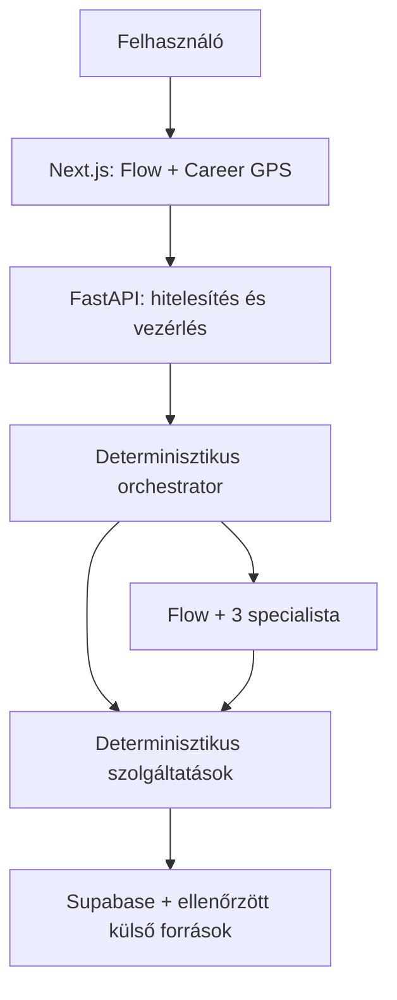
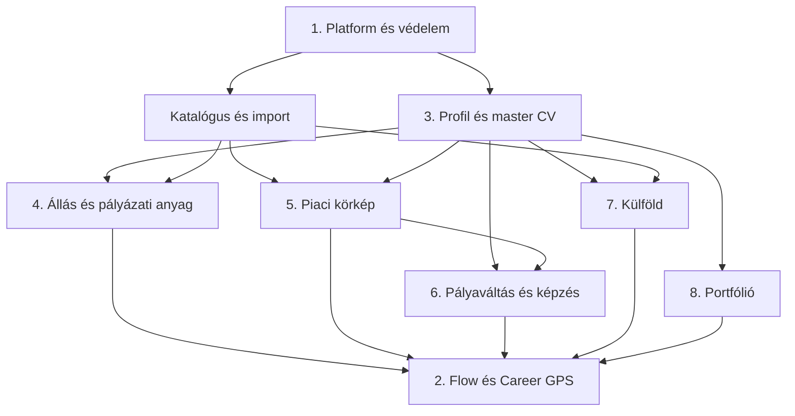

# Karrier-Ügynökség — részletes fejlesztési terv

> **Kanonikus elsőbbség:** a részletes tervet nem töröljük, de a felhasználói
> utak, indítási feltételek, állapotátmenetek és jóváhagyási pontok
> tekintetében a [felhasználói állapotgép](../felhasznaloi-allapotgep.md) az
> irányadó.

Állapot: **3. fázis — az 1. megvalósítási csomag elindult**
Alapja: a [jóváhagyott rendszerterv](../rendszerterv.md).
Ez a dokumentáció még nem programkód és nem adatbázis-migráció.

## 1. Dokumentumtérkép

| # | Főrész | Részletes terv |
|---|---|---|
| 1 | Platform, adat és biztonság | [01-platform-adat-biztonsag.md](01-platform-adat-biztonsag.md) |
| 2 | Flow és Career GPS | [02-flow-career-gps.md](02-flow-career-gps.md) |
| 3 | Karrierprofil és CV | [03-karrierprofil-cv.md](03-karrierprofil-cv.md) |
| 4 | Állások és pályázati anyagok | [04-allasok-palyazati-anyagok.md](04-allasok-palyazati-anyagok.md) |
| 5 | Piaci körkép és karriertanácsadás | [05-piaci-korkep-tanacsadas.md](05-piaci-korkep-tanacsadas.md) |
| 6 | Pályaváltás és képzések | [06-palyavaltas-kepzesek.md](06-palyavaltas-kepzesek.md) |
| 7 | Külföldi lehetőségek | [07-kulfoldi-lehetosegek.md](07-kulfoldi-lehetosegek.md) |
| 8 | Portfólió Stúdió | [08-portfolio-studio.md](08-portfolio-studio.md) |

## 2. Rögzített architektúra

- **Next.js** felel a felületért, állapotmegjelenítésért és streaming válaszért.
- **FastAPI** az egyetlen üzleti backend; ellenőrzi a JWT-t, jogosultságot,
  bemenetet, kvótát és jóváhagyást.
- **Supabase** biztosítja az Authot, PostgreSQL-adatbázist, Storage-ot és a
  tudásanyag vektoros keresését.
- **Az orchestrator programkód**, nem LLM: állapotgépet, szabályokat és
  engedélyeket hajt végre.
- **Az LLM-ek nem kapnak közvetlen adatbázis- vagy publikálási jogot.**

## 3. A négy agent végleges feladata

| Agent | Feladat | Engedélyezett eszköztípus | Tiltott művelet |
|---|---|---|---|
| Flow Manager | Szándékfelismerés, egy következő lépés kiválasztása, közérthető válasz | Csak olvasó és javaslatkészítő eszközök | Közvetlen DB-írás, küldés, publikálás |
| Career Advisor | Profil-, teszt-, piac- és tudásanyag-alapú tanács | Ellenőrzött profil, RAG, piaci összesítések | Diagnózis, forrás nélküli piaci állítás |
| Application Materials Agent | CV- és motivációslevél-tervezet | Igazolt profil, kiválasztott állás, ATS-eredmény | Új készség vagy tapasztalat kitalálása |
| Portfolio Designer | Szerkezet, vizuális irány és projektbemutatás megtervezése | Igazolt projektadatok és biztonságos komponenskatalógus | Nyers HTML/JavaScript futtatása vagy publikálás |

Az agentek **manager mintában**, Flow mögött, eszközként működnek. A
felhasználóval nem váltogatnak külön személyiségeket.

## 4. Determinisztikus szolgáltatások

| Szolgáltatás | Bemenet | Kimenet |
|---|---|---|
| Bemenet- és fájlellenőrző | Szöveg, URL, fájl | Elfogadott, elutasított vagy karanténba tett adat |
| Profil-normalizáló | CV-mezők és felhasználói válaszok | Egységes, forrással jelölt profilmezők |
| Career GPS állapotgép | Ellenőrzött események | Új GPS-állapot és következő lehetséges lépések |
| Állásillesztő | Profil, cél és álláshirdetés | Átlátható pontszám, blokkoló okok, bizonyosság |
| ATS-elemző | CV és kiválasztott állás | Formai, kulcsszó- és bizonyítékhiány |
| Piaci aggregátor | Hirdetések és statisztikák | Dátumozott mérőszámok és grafikon-adatok |
| Tesztértékelő | Válaszok és verziózott kulcs | Eredmény, skálák és megbízhatóság |
| Pályaátjárás-rangsoroló | Profil, szakmák, piac, korlátok | Reális célpályák és készséghiány |
| Képzésrangsoroló | Készséghiány és felhasználói korlátok | Ellenőrzött képzési lista |
| Külföldi rangsoroló | Profil, célország és EURES-adat | Jogosultsági kapukkal ellátott találatok |
| Portfólió-renderelő | Jóváhagyott tartalom és design-specifikáció | Biztonságos HTML-előnézet és verzió |

**Determinisztikus sanitizálás:** előre rögzített program szabályai alapján
ellenőrzés, normalizálás és veszélyes tartalom eltávolítása. Azonos bemenet és
szabályverzió azonos eredményt ad; ebben LLM nem dönt.

## 5. Közös adatkontraktusok

Minden rekord UUID-t, `created_at`, `updated_at` és szükség esetén
`version` mezőt kap. A felhasználói rekordok kötelező tulajdonosi mezője:
`user_id = auth.uid()`.

| Kontraktus | Kötelező tartalom | Szabály |
|---|---|---|
| Evidence | forrástípus, forrásazonosító, idézhető rész, dátum | Szakmai tény csak bizonyítékkal lesz igazolt |
| CareerProfileSnapshot | cél, tapasztalat, készség, végzettség, nyelv, korlátok | Verziózott; agent nem írhatja közvetlenül |
| CareerGPSState | aktív cél, készültségi állapotok, blokkolók, következő lépések | Csak érvényes domain-esemény módosítja |
| JobMatch | komponenspontok, hard gate-ek, összpontszám, confidence | A képlet és szabályverzió kötelező |
| MarketSnapshot | szakma, időszak, mintanagyság, forrásdátum, metrikák | Elavult vagy kis minta külön jelölendő |
| ApprovalRequest | művelet, pontos előnézet, állapot, lejárat | Jóváhagyás egyszer használható |
| AgentRun | agent, bemeneti hivatkozások, eszközök, kimeneti séma, költség | Személyes adatot nem naplózunk nyersen |
| PortfolioVersion | tartalomverzió, theme, assetek, publikációs állapot | Publikálás külön jóváhagyással |

### Meglévő katalógusadatok

Az alkalmazás továbbra is használja a meglévő `szakmak`, `cegek`,
`hirdetesek`, `keszsegek`, `hirdetes_keszseg`, `piaci_statisztikak`,
`kepzesek`, `tudasanyag` és `feor_lista` táblákat. Ezeket nem másoljuk át
agent-memóriába; lekérdező szolgáltatások adják át a szükséges, szűkített
adatot.

### Új felhasználói és működési adatok

A részletes megvalósításban külön, tulajdonoshoz kötött tárolás szükséges:
profilverziók, dokumentumok, célok, GPS-események, mentett állások,
illesztési eredmények, pályázati csomagok, teszteredmények,
jóváhagyások, agent-futások és portfólióverziók számára.

## 6. Jogosultsági modell

| Adatosztály | Böngésző | Hitelesített backend | Agent | Admin/karbantartó |
|---|---|---|---|---|
| Nyilvános katalógus | Csak engedélyezett olvasás | Olvasás | Szűkített tool-válasz | Írás ellenőrzött importtal |
| Saját felhasználói adat | Saját sor RLS-sel | Saját felhasználó nevében | Csak szükséges mezők | Alapból nincs tartalmi hozzáférés |
| Belső működési adat | Nincs | Szűk szolgáltatási jog | Nincs közvetlen hozzáférés | Auditált hozzáférés |
| Külső művelet | Nincs közvetlenül | Jóváhagyás után | Csak javasolhat | Házirend szerint |

Kliensoldalra csak Supabase **publishable** kulcs kerülhet. Secret vagy
`service_role` kulcs soha. Szerveroldali hozzáférésnél a JWT aláírását és
claimjeit ellenőrizni kell; jogosultsági döntés nem alapulhat szerkeszthető
`user_metadata` mezőn.

## 7. Agent- és promptbiztonsági szerződés

1. CV, hirdetés, weboldal, RAG-részlet és chatüzenet **nem megbízható adat**.
2. Nem kerülhet felhasználói szöveg developer/system utasításba.
3. Agentek között csak verziózott, validált strukturált kimenet haladhat.
4. Minden toolnak szűk input-sémája, timeoutja, limitje és engedélye van.
5. Küldés, törlés, adatmegosztás és publikálás előtt pontos előnézet és
   emberi jóváhagyás kötelező.
6. A kimeneti guardrail blokkolja a nem bizonyított CV-állítást, forrás nélküli
   piaci állítást és tiltott egészségügyi diagnózist.
7. Futásonként korlát: agentlépések, toolhívások, token, idő és költség.
8. Trace és eval szükséges, de a napló személyes adatait maszkolni kell.

## 8. Kapcsolati szabályok

- Flow bármely főrészt elindíthat, de csak az orchestrator engedélyével.
- Profiladatot kizárólag a profilfőrész módosíthat.
- Career GPS-t kizárólag domain-események módosítják.
- Állásanyag csak kiválasztott álláshoz és megerősített profilhoz készülhet.
- Piaci, képzési és külföldi állítás csak forrással és frissességgel jelenhet meg.
- A Portfolio Designer csak tervet készít; a renderelő állítja elő a HTML-t.
- Egyetlen agent sem hívhat másik agentet közvetlenül; ezt Flow kezeli.

## 9. Négy végponttól végpontig tartó út

| Út | Kötelező sorrend | Eredmény |
|---|---|---|
| Van CV | feltöltés → kivonat → felhasználói javítás → profil → cél → állásillesztés | igazolt profil és shortlist |
| Nincs CV | rövid interjú → profilvázlat → megerősítés → cél → első CV | tényalapú CV és továbblépés |
| Pályaváltás/kimerülés | profil → teszt/opcionális kérdések → átjárások → piac → képzés → terv | reális, lépésekre bontott karrierút |
| Külföld | profil → ország/nyelv/jogosultság → EURES-találatok → hiányok → dokumentum | forrásolt külföldi shortlist |

A portfólió bármelyik útból elindítható, ha már van legalább egy igazolt
projekt vagy bemutatható munkaminta.

## 10. Közös frontend-szerződés

- Bal oldal: Flow beszélgetés, aktuális munkakártya és egy elsődleges művelet.
- Jobb oldal: Career GPS, források, készültség, blokkolók és következő lépés.
- Mobil: Flow teljes szélességben, GPS lenyitható alsó panelben.
- Nem épül vissza hat statikus, egymástól elszigetelt fül.
- A meglévő sötétkék–arany arculat, logó és professzionális karakter megmarad.
- Pontszámhoz mindig megjelenik a számítás oka; AI-szöveg és adat külön jelölést kap.
- Hosszú műveletnél valódi állapotjelzés látszik, nem hamis százalékos animáció.
- Hiba esetén a felhasználó munkája megmarad, és egyértelmű újrapróbálás jelenik meg.

## 11. Minőségi kapuk a programozás előtt

A 2. fázis akkor zárható le, ha:

1. mind a nyolc specifikáció ugyanazt az adat- és jogosultsági modellt használja;
2. nincs olyan pontszám vagy adatbázis-írás, amelyről LLM dönt;
3. minden külső művelethez rögzített jóváhagyási pont tartozik;
4. minden személyre szabott állítás visszavezethető profilbizonyítékra;
5. minden piaci állítás forrás- és frissességi szerződéssel rendelkezik;
6. minden főrésznek mérhető backend-, frontend-, biztonsági és E2E tesztje van;
7. a megvalósítási sorrendnek nincs körkörös függősége.

Programozás csak e kapuk és a nyolc részletes specifikáció jóváhagyása után
kezdődhet.

## 12. Tervezési források és verziókorlátok

- OpenAI manager minta és agents-as-tools:
  <https://developers.openai.com/api/docs/guides/agents/orchestration>
- OpenAI agentbiztonság, strukturált adatáramlás és prompt injection:
  <https://developers.openai.com/api/docs/guides/agent-builder-safety>
- OpenAI guardrail és emberi jóváhagyás:
  <https://developers.openai.com/api/docs/guides/agents/guardrails-approvals>
- Supabase Next.js SSR és szerveroldali tokenellenőrzés:
  <https://supabase.com/docs/guides/auth/server-side/creating-a-client>
- Supabase változásnapló:
  <https://supabase.com/changelog>

### 2026. július 23-án ellenőrzött megvalósítási alap

| Réteg | Rögzített verzió/állapot |
|---|---|
| Vercel Node.js | `24.x`; a fejlesztői ellenőrzés `24.14.0` alatt futott |
| Next.js | `16.2.11` |
| React / React DOM | `19.2.8` |
| Supabase JavaScript / SSR | `2.110.8` / `0.12.3` |
| Python | `3.12.13` |
| FastAPI / Pydantic / Uvicorn | `0.139.2` / `2.13.4` / `0.51.0` |
| Supabase Python | `2.31.0` |
| Supabase Postgres | platform `17.6.1.141`, szerver `17.6` |
| pgvector | `0.8.2`; a migráció az `extensions` sémába helyezi |
| Supabase kulcsmodell | aktív modern publishable kulcs; secret csak backendhez |
| Data API | csak az explicit `api` séma; automatikus új-tábla-exponálás nélkül |

A verziók a csomagfájlokban pontosan rögzítettek. Az új platformváltozások
miatt Node.js 22 helyett **Node.js 24** lett a projekt célverziója.

## 13. Függőségi és megvalósítási térkép

Flow kerete a fejlesztés elején létrejön, majd főrészenként kap működő
toolokat. A végső Flow/GPS integráció csak a mögöttes szolgáltatások után
zárható le.

### Programozási csomagok

1. **Alap:** auth, RLS, Storage, API-policy, job/approval/audit és CI-védelem.
2. **Első teljes út:** Flow-keret + CV-import/CV nélküli profil + Career GPS.
3. **Adatból ajánlás:** katalógusminőség + piac + személyes állásillesztés.
4. **Pályázás:** ATS + célzott CV/levél + export.
5. **Karrierút:** tanácsadás + teszt + pályaváltás + képzés.
6. **Külföld:** EURES + külföldi gate-ek + idegen nyelvű anyag.
7. **Portfólió:** rugalmas tartalom + Designer + biztonságos renderer.
8. **Rendszerszint:** teljes E2E, security/prompt-injection eval, terhelés,
   költségmérés és Vercel/production ellenőrzés.

Minden csomag külön ágon és külön review-ban készül. A következő csomag csak
az előző mérhető elfogadási feltételeinek teljesülése után indul.
